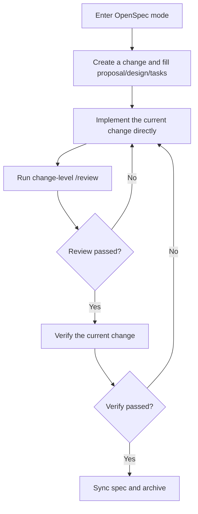
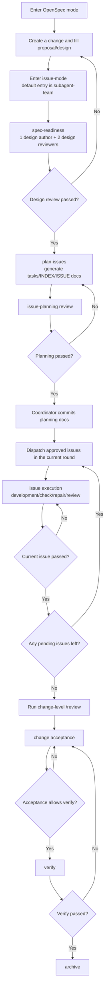

# OpenSpec Extensions

> [!TIP]
> Language / 语言: [简体中文（默认）](./README.md) | **English**

> [!IMPORTANT]
> Special thanks! This skill set is built on top of **Tang Jie**'s RRA subagent-team workflow foundation.

I built this repository to make OpenSpec feel like a durable engineering workflow instead of a collection of slash commands people have to memorize. It does not replace OpenSpec itself. What it does is extend an initialized OpenSpec repo with a TypeScript CLI, installable skills, and a default `issue-mode` template that plugs into the toolchain the user already chose.

## The Four Things I Want To Say Up Front

- I want people to use OpenSpec through natural language instead of remembering command choreography.
- I made the execution model configurable, so a project can stay conservative or push much further into automation.
- I treat unattended execution as a first-class requirement, so the coordinator can continue across stages when the config allows it.
- I keep backlog, round, progress, and run state on disk, which makes cross-session tracking practical instead of aspirational.

## What This Repository Is

- This is the source repository for `openspec-extensions`, and it is also the package published to npm.
- It ships the TypeScript CLI, `issue-mode` render/execute/reconcile logic, installable skills, and the default `issue-mode` template.
- It installs OpenSpec `1.2.x` as a bundled runtime dependency and prefers that official CLI during `init`. I am not rebuilding OpenSpec here.
- It no longer carries the old detached-worker, heartbeat, or monitor-worker fallback runtime. The current model is coordinator plus issue-mode artifacts, with optional subagent-team execution on top.

## Quick Start

Install the CLI globally:

```bash
npm install -g openspec-extensions
```

That install also pulls in `@fission-ai/openspec@~1.2.0` as a runtime dependency of `openspec-extensions` and exposes three global commands: `openspec`, `openspec-ex`, and `openspec-extensions`. A fresh machine does not need a separate manual OpenSpec install first.

Then initialize from the target project:

```bash
cd /path/to/your/project
openspec-ex init
```

Check the bundled OpenSpec version:

```bash
openspec --version
```

Check the extensions CLI version:

```bash
openspec-ex --version
```

Equivalent form:

```bash
openspec-extensions init /path/to/your/project
```

This command checks whether the target repo already has `openspec/config.yaml`. If it does not, I first call the bundled official `openspec init`. Only when that bundled OpenSpec is unavailable do I fall back to `npx @fission-ai/openspec@~1.2.0`, then continue with extension installation.

If you do not pass `--openspec-tools`, I hand the current terminal straight to the official `openspec init`, so you get the same interactive tool picker as the native command. I only switch to a non-interactive pass-through when the user explicitly provides `--openspec-tools <tools>`.

If OpenSpec initialization already selected a toolchain, I follow that choice. I do not assume `.codex` by default anymore.

When you run `openspec-ex init` in an interactive terminal and the local `openspec-extensions` version is behind npm latest, the command first asks in English whether you want to upgrade the local CLI. If you confirm, it runs `npm install -g openspec-extensions@<latest>` and then continues the same `init` through the upgraded `openspec-ex`.

When this `init` run is actually going to write `openspec/issue-mode.json`, the CLI then asks in English whether you want `Semi-automatic and controllable` or `Fully automatic and hands-off`. If the target repo already has an `issue-mode.json` and you do not pass `--force-config`, the prompt is skipped because the config would be preserved anyway.

If the repo is already initialized, you can install just the extensions:

```bash
openspec-extensions install --target-repo /path/to/your/project
```

Common options:

- Preview installation: `openspec-extensions install --target-repo /path/to/your/project --dry-run`
- Overwrite existing skills: `openspec-extensions install --target-repo /path/to/your/project --force`
- Overwrite `openspec/issue-mode.json`: `openspec-extensions install --target-repo /path/to/your/project --force-config`
- Check the bundled OpenSpec version: `openspec --version`
- Check the extensions CLI version: `openspec-ex -v`, `openspec-ex --version`
- Upgrade the global CLI: `npm install -g openspec-extensions@latest`
- Upgrade extension skills already installed in a target repo: `openspec-ex init --force`, or `openspec-extensions install --target-repo /path/to/your/project --force`
- Upgrade skills and also overwrite the default config template: `openspec-ex init --force --force-config`

If you only upgrade the npm package version, existing installed skill directories in the target repo are not silently overwritten. My recommendation is to run `--dry-run` first, then use `--force` to upgrade the installed skills. If you also want the latest `openspec/issue-mode.json` template, add `--force-config`. Legacy detached-worker runtime leftovers are also cleaned up during a `--force` upgrade.

## What Gets Installed

I install the following extension skills into the OpenSpec-managed `<toolDir>/skills/` roots:

- `openspec-chat-router`
- `openspec-plan-issues`
- `openspec-dispatch-issue`
- `openspec-execute-issue`
- `openspec-reconcile-change`
- `openspec-subagent-team`

If the user selected Claude Code during `openspec init`, those skills land in `.claude/skills/`. If the user selected Codex, they land in `.codex/skills/`. If a repo is configured for multiple tools, I install the same extension set into every detected skill root instead of assuming a single default directory.

I also write:

- `openspec/issue-mode.json`

And, when needed, I append these entries to the target repo's `.gitignore`:

```text
.worktree/
openspec/changes/*/runs/CHANGE-VERIFY.json
openspec/changes/*/runs/CHANGE-REVIEW.json
```

## The Working Style I Recommend

### Automatic Complexity Triage

You can let the AI choose between the short path and the complex path, but it should do so through explainable heuristics instead of a vague gut feeling.

- Default to the short path when the scope is concentrated, the boundaries are clear, issue splitting is unnecessary, and one implementation pass plus change-level review is likely enough.
- Default to the complex path when the work crosses modules, the design is still uncertain, design review is needed, issue splitting is likely, validation is multi-stage or expensive, or the user explicitly wants a long-running unattended lifecycle.
- For borderline cases, prefer `new` or `ff` first so proposal/design become clearer, then re-evaluate instead of forcing issue-mode too early.
- If a short-path execution reveals cross-module scope, repeated review loops, or natural issue boundaries, explicitly upgrade to the complex path and state why.
- Once the triage selects the complex path, immediately restate a short route decision such as: `Route decision: complex flow. Only proposal/design and spec_readiness are allowed now; implementation is forbidden.`
- The complex-path result is a routing decision, not implementation authorization. Before `runs/SPEC-READINESS.json` is current and passed, do not start implementation, do not run scaffolding, and do not launch code-writing subagents.
- Even after spec-readiness passes, the first issue execution still waits for a current passed `runs/ISSUE-PLANNING.json` and the planning-doc commit. Do not let phrases like "start implementing", "continue", or "enable subagent-team" skip those prerequisites.
- Once the current change has written issue-mode artifacts on disk, such as `issues/*.progress.json`, `issues/*.team.dispatch.md`, or `runs/ISSUE-PLANNING.json`, that state should outrank generic phrases like "start implementing" or "just do it". The default move is to reconcile first and continue the `subagent-team` main path unless you explicitly ask to go back to the simple flow.

The route explanation should stay short and concrete, for example:

- `Start with the short path because the scope is concentrated and does not need issue splitting.`
- `Switch to the complex path because the change already crosses modules and needs design review plus issue splitting.`

If you want the AI to do more than classify complexity and to directly use `subagent-team` when the result is complex, put that authorization into the prompt itself, for example:

```text
Enter OpenSpec mode.
Judge the requirement complexity yourself; if it belongs to the complex path, automatically enable subagent-team and proceed without asking me again.
If spawned subagents are needed, explicitly use `<specified-model>`.
Requirement: <requirement-description>
```

### Small Changes

If the task is small enough, I recommend staying on the short OpenSpec path: create a change, fill in proposal/design/tasks, implement it, run change-level review, then verify and archive. This repository does not force every task into multi-issue execution.



If I want an agent to follow the short path for a small task, these are the prompts I usually use:

1. Enter OpenSpec mode

```text
Enter OpenSpec mode. I am working on a small task, so stay on the short path and do not default to splitting it into multiple issues.
```

2. Create the change and fill in the docs

```text
Create a change for this request and fill proposal, design, and tasks until they are implementation-ready.
```

3. Implement the current change directly

```text
Start implementing the current change. If the scope is still small, and the change has not entered issue-mode yet, do not split into issues. Just complete the implementation and run validation.
```

4. Finish with review / verify / archive

```text
Run a change-level /review on the unpushed code in the current branch, excluding openspec/changes/**. If review passes, check whether the change is ready to archive. If verify passes, sync the spec and archive it.
```

5. If the session returns too early

```text
Continue the current change and keep moving on the OpenSpec main path. Finish review first, then verify and archive.
```

If the current change already split into issues and the session dropped, I recommend wording the resume request like this:

```text
This change is already in issue-mode. Reconcile from the issue/progress/dispatch artifacts on disk first, then continue the subagent-team main path. Do not fall back to apply just because I said "start implementing".
```

### Complex Changes

If the work is large enough to split into issues, I want it to move through `issue-mode`:

1. Get proposal and design to a reviewable state.
2. Pass `spec_readiness` as the design gate.
3. Use `openspec-plan-issues` to generate `tasks.md`, `issues/INDEX.md`, and each `ISSUE-*.md`.
4. Create or reuse a workspace only for the approved issues in the current round.
5. Use dispatch packets to run `development -> check -> repair -> review`.
6. Persist issue-local progress/run artifacts, then let the coordinator reconcile, review, merge, commit, verify, and archive.

The point of this flow is not merely “more agents.” The point is to move the control plane back onto disk and into the coordinator, so the change stays inspectable even when a session drops, a subagent fails, or a human needs to step in.



> [!IMPORTANT]
> If I want the agent to actually launch `subagent-team`, I do not just say “continue this change.” I recommend making two things explicit in the prompt:
> 1. Say that `subagent-team` or multi-agent orchestration must be enabled.
> 2. Say which LLM model I want, so spawned subagents do not silently fall back to the runtime default.
>
> This is the form I usually recommend:
>
> ```text
> Continue this change in issue-mode, enable subagent-team, and explicitly use the model I specify for all spawned subagents.
> ```
>
> If the current agent or runtime does not support `subagent-team` or delegation at all, do not get stuck on the name. The fallback should be:
> - Keep using the lifecycle packet and `ISSUE-*.team.dispatch.md` as the round contract.
> - Let the main session run `development -> check -> repair -> review` serially.
> - Handle one approved issue at a time and keep writing issue-local progress and run artifacts.

If I want an agent to follow the full lifecycle for a complex change, these are the prompts I usually use:

0. One-line unattended kickoff

```text
Enter OpenSpec mode.
Create a new change, use subagent-team for execution, and explicitly use `<specified-model>` for all spawned subagents.
Requirement: <requirement-description>
```

1. Enter OpenSpec mode

```text
Enter OpenSpec mode. I am working on a complex change and I want the full lifecycle, not the short path.
```

2. Create the change and fill proposal / design

```text
Create a change for this request and fill proposal and design first. Do not start implementation yet and do not split tasks before the design is ready.
```

3. Enter issue-mode and make `subagent-team` explicit

```text
Continue this change in issue-mode. Use subagent-team as the default entry point and drive the full lifecycle with multi-agent orchestration.
Explicitly set model and reasoning_effort for spawned subagents instead of inheriting environment defaults.
```

4. If I want unattended progression

```text
Create a complex change and use subagent-team as the default entry point. Run the lifecycle in full-auto mode.
If subagents need time, use blocking waits up to one hour instead of short polling.
Do not pass the current gate until all required review/check subagents have finished and their verdicts are collected.
```

5. If I want to inspect the design and task split before continuing

```text
Use issue-mode to complete proposal, design, and design review first.
After design review passes, do task planning, but do not automatically continue into the next stage. I want to inspect the design docs and issue split first.
```

6. If the session returns too early

```text
Continue the current change and stay on the subagent-team main path.
If subagents are still running, wait up to one hour before returning.
If the current phase still has review/check subagents running, collect all verdicts before deciding whether to move forward.
```

## Unattended Execution And Cross-Session Tracking

I built `issue-mode` as a workflow that can keep moving over time, not as a one-shot prompt.

- `tasks.md`, `issues/*.md`, `issues/*.progress.json`, and `runs/*.json` all belong to the control plane.
- The coordinator uses `reconcile` to recover state from those artifacts instead of depending only on chat history.
- `subagent_team.*` decides which gates can auto-accept; `rra.gate_mode` decides whether a gate is advisory or blocking.
- The default template accepts and commits each issue after issue-local validation passes, which makes it much easier to resume across sessions and understand exactly where a change stopped.

If the question is “where did this change stop yesterday?”, “why did the last review fail?”, or “is this ready for verify now?”, the answer should come from artifacts first and chat context second.

## Configuration Surface

The config I expect people to touch most often lives in `openspec/issue-mode.json`:

```json
{
  "worktree_root": ".worktree",
  "validation_commands": ["pnpm lint", "pnpm type-check"],
  "worker_worktree": {
    "enabled": true,
    "scope": "change",
    "mode": "detach",
    "base_ref": "HEAD",
    "branch_prefix": "opsx"
  },
  "rra": {
    "gate_mode": "advisory"
  },
  "subagent_team": {
    "auto_accept_spec_readiness": false,
    "auto_accept_issue_planning": false,
    "auto_accept_issue_review": true,
    "auto_accept_change_acceptance": false,
    "auto_archive_after_verify": false
  }
}
```

This is how I usually explain the important fields:

- `validation_commands`: the default validation suite for each issue.
- `worker_worktree.scope`:
  - `shared` runs directly in the repo root.
  - `change` reuses one `.worktree/<change>` for the whole change. This is the default and usually the right choice for serial issue work.
  - `issue` creates `.worktree/<change>/<issue>` isolation per issue and only makes sense when parallel isolation is really needed.
- `rra.gate_mode`:
  - `advisory` computes gates without hard-blocking the flow.
  - `enforce` turns the round contract into a hard constraint.
- `subagent_team.*`: controls which lifecycle gates may auto-accept and continue.

For a semi-automatic setup, I usually keep `rra.gate_mode=advisory` and leave key approvals manual. For a fully unattended setup, I usually switch to `rra.gate_mode=enforce` and turn on all five `subagent_team` switches.

## Configuration Examples

### Semi-Automatic

If I want to keep manual checkpoints around design, planning, acceptance, and archive, this is usually where I start:

```json
{
  "worktree_root": ".worktree",
  "validation_commands": ["pnpm lint", "pnpm type-check"],
  "worker_worktree": {
    "enabled": true,
    "scope": "change",
    "mode": "detach",
    "base_ref": "HEAD",
    "branch_prefix": "opsx"
  },
  "rra": {
    "gate_mode": "advisory"
  },
  "subagent_team": {
    "auto_accept_spec_readiness": false,
    "auto_accept_issue_planning": false,
    "auto_accept_issue_review": false,
    "auto_accept_change_acceptance": false,
    "auto_archive_after_verify": false
  }
}
```

In practice, that usually means:

- Design review passes, then waits for me before moving into task planning.
- Issue planning reaches a ready state, then waits for me to confirm boundaries, ownership, and acceptance.
- A finished issue still waits for me before acceptance and dispatching the next one.
- Verify and archive stay manual.
- RRA still computes the round contract, but does not hard-block the flow.

If I only want each issue to auto-commit once issue-local validation passes, I can just turn on `auto_accept_issue_review`.

### Full-Automatic

If my goal is to push a complex change forward with minimal supervision, this is usually where I start:

```json
{
  "worktree_root": ".worktree",
  "validation_commands": ["pnpm lint", "pnpm type-check"],
  "worker_worktree": {
    "enabled": true,
    "scope": "change",
    "mode": "detach",
    "base_ref": "HEAD",
    "branch_prefix": "opsx"
  },
  "rra": {
    "gate_mode": "enforce"
  },
  "subagent_team": {
    "auto_accept_spec_readiness": true,
    "auto_accept_issue_planning": true,
    "auto_accept_issue_review": true,
    "auto_accept_change_acceptance": true,
    "auto_archive_after_verify": true
  }
}
```

In practice, that usually means:

- Design review automatically moves into task planning once it passes.
- Issue planning automatically commits planning docs and dispatches the approved round.
- Issue review automatically accepts and commits the issue, then continues into the next issue or change acceptance.
- Change-level review and acceptance move into verify as soon as the gate is satisfied.
- Verify automatically moves into archive.
- `rra.gate_mode=enforce` keeps the round contract as a hard boundary so the flow does not drift forward blindly.

## Runtime Boundaries

I designed `openspec-subagent-team` as the default entry point for complex changes, but runtime permissions always outrank skill contracts, so there are a few practical boundaries worth stating clearly:

- Some agent runtimes treat real subagent or delegation launches as higher-privilege actions and require explicit user authorization.
- Some runtimes let spawned subagents inherit the default model or default `reasoning_effort`. If quality or cost matters, set them explicitly.
- Gate-bearing check/review subagents usually need long blocking waits if the goal is truly unattended execution.

If the current agent or runtime does not support delegation at all, my recommendation is not to force `subagent-team`. Instead, fall back to the main-session serial issue path:

- Keep using the same lifecycle packet and `ISSUE-*.team.dispatch.md` as the round contract.
- Let the main session execute `development -> check -> repair -> review`.
- Handle one approved issue at a time.
- Keep writing issue-local progress/run artifacts, then let the coordinator reconcile, review, verify, and archive.

In other words, when delegation is unavailable, what degrades is the parallel orchestration layer, not the `issue-mode` control plane.

## Included Skills

| Skill | What I use it for |
| --- | --- |
| `openspec-chat-router` | Route natural-language requests into the correct OpenSpec stage |
| `openspec-plan-issues` | Split a change into executable issues and generate planning docs |
| `openspec-dispatch-issue` | Render dispatch for the current issue and create or reuse the workspace |
| `openspec-execute-issue` | Implement within issue boundaries, run validation, and write progress artifacts |
| `openspec-reconcile-change` | Recover coordinator state from issue-local progress and run artifacts |
| `openspec-subagent-team` | Run the development, check, repair, and review loop for complex changes |

## Repository Layout

```text
.
├── README.md
├── README.en.md
├── src/
├── tests/
├── skills/
└── templates/
```

More specifically:

- `src/cli/index.ts` defines the CLI entry.
- `src/commands/` contains command handlers.
- `src/domain/` contains change and issue-mode logic.
- `src/renderers/` renders dispatch packets and lifecycle output.
- `src/git/` contains git helpers.
- `skills/` contains the extension skills installed into target repos.
- `templates/issue-mode.json` is the default config template.
- `tests/` contains CLI, integration, and unit coverage.

## Local Development

This repository has already completed the TypeScript CLI cutover and no longer keeps a Python runtime compatibility layer. Common commands:

- Install dependencies: `npm install`
- Build the CLI: `npm run build`
- Run ESLint: `npm run lint`
- Run the type checker: `npm run type-check`
- Run tests: `npm test`
- Run the package smoke test: `npm run smoke:package`

Migration notes, upgrade guidance, and rollback notes live in [docs/ts-migration-release-notes.md](./docs/ts-migration-release-notes.md).

## Current State

Today, the stable mental model for this project is:

- The default entry is OpenSpec plus `issue-mode`, not an old installer wrapper.
- The default complex path is coordinator plus optional subagent team, not the detached-worker runtime.
- The default worktree strategy is change-scoped reuse, because that works best for serial issues and cross-session recovery.
- The default goal is to connect natural language, configuration, unattended execution, and progress tracking into one workflow that can hold up over time.
