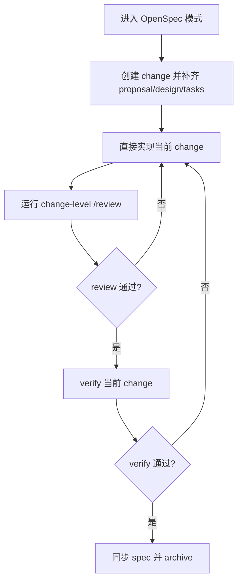
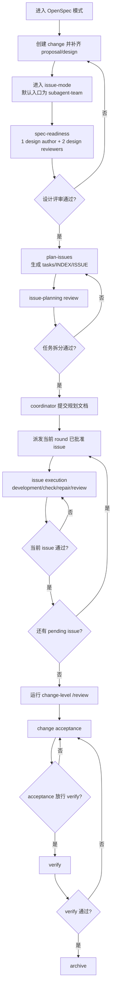

# OpenSpec Extensions

> [!TIP]
> 语言 / Language：**简体中文（默认）** | [English](./README.en.md)

> [!IMPORTANT]
> 特别鸣谢！本 skill 基于 **唐杰** 提供的 rra subagent team 工作流基座。

我做这个仓库，是想把 OpenSpec 补成一套更适合长期工程协作的 `issue-mode` 扩展，而不是再让人记一堆 slash command。它不会替代 OpenSpec 本体；它做的事情，是在 `openspec init` 之后，把扩展 CLI、skills 和默认模板接进你已经选好的工具链里。

## 我最想先强调的四件事

- 我希望你用自然语言使用 OpenSpec，而不是背命令和手工拼流程。
- 我把执行模型做成可配置的，你可以按项目需要选择更保守的半自动，也可以打开更激进的自动推进。
- 我把无人值守当成一等目标来设计，coordinator 可以按配置跨阶段继续推进，而不是每一步都等人点下一次。
- 我把 backlog、round、progress、run artifact 都落到磁盘里，这样你换会话、换 agent、隔天再回来，都还能继续追踪同一个 change。

## 这个仓库是什么

- 这是 `openspec-extensions` 的源码仓库，也是发布到 npm 的包内容。
- 它提供 TypeScript CLI、`issue-mode` 相关 render/execute/reconcile 逻辑、可安装 skills，以及默认的 `issue-mode` 模板。
- 它依赖 OpenSpec 本体先完成初始化；我没有在这里重造一套 OpenSpec。
- 这里已经不再保留 detached worker、heartbeat、monitor-worker 这一套旧 fallback runtime。当前主链就是 coordinator 加 issue-mode artifacts，加上可选的 subagent team。

## 快速开始

先全局安装 CLI：

```bash
npm install -g openspec-extensions
```

在目标项目里初始化：

```bash
cd /path/to/your/project
openspec-ex init
```

等价写法：

```bash
openspec-extensions init /path/to/your/project
```

这条命令会先检查目标仓库有没有 `openspec/config.yaml`。如果还没有，我会先调用官方 `openspec init`；如果当前环境没有全局 `openspec` CLI，就回退到 `npx @fission-ai/openspec`，然后继续安装扩展。

如果你没有显式传 `--openspec-tools`，我会把当前终端直接交给官方 `openspec init`，所以你会看到和原生命令一致的工具选择交互；只有当你明确传入 `--openspec-tools <tools>` 时，才会改成无交互透传。

如果你已经在 OpenSpec 初始化时选好了工具链，我默认跟随那次选择，不会擅自把 skills 安到 `.codex`。

如果你是在交互终端里运行 `openspec-ex init`，而当前本地 `openspec-extensions` 版本落后于 npm 最新版，命令会先询问你是否要用最新版接管这一次 `init`。确认后会通过 `npx` 继续本次执行，但不会自动改写你现有的全局安装。

如果仓库已经完成 OpenSpec 初始化，也可以只做扩展安装：

```bash
openspec-extensions install --target-repo /path/to/your/project
```

常用选项：

- 预览安装结果：`openspec-extensions install --target-repo /path/to/your/project --dry-run`
- 覆盖同名 skills：`openspec-extensions install --target-repo /path/to/your/project --force`
- 覆盖 `openspec/issue-mode.json`：`openspec-extensions install --target-repo /path/to/your/project --force-config`
- 升级全局 CLI：`npm install -g openspec-extensions@latest`
- 升级目标仓库里已安装的扩展 skills：`openspec-ex init --force`，或 `openspec-extensions install --target-repo /path/to/your/project --force`
- 升级 skills 的同时覆盖新的默认配置模板：`openspec-ex init --force --force-config`

如果你只是升级了 npm 包版本，目标仓库里已经存在的同名 skills 默认不会被静默覆盖。我建议先用 `--dry-run` 看安装结果，再用 `--force` 执行升级；如果你还想吃到新的 `openspec/issue-mode.json` 模板，再额外加 `--force-config`。旧版遗留的 detached-worker 相关运行时残留，也会在 `--force` 升级时一起清理。

## 它会安装什么

我会把下面这组扩展 skills 安到 OpenSpec 已配置工具对应的 `<toolDir>/skills/` 下：

- `openspec-chat-router`
- `openspec-plan-issues`
- `openspec-dispatch-issue`
- `openspec-execute-issue`
- `openspec-reconcile-change`
- `openspec-subagent-team`

如果你在 `openspec init` 里选的是 Claude Code，它们会进入 `.claude/skills/`；如果选的是 Codex，就会进入 `.codex/skills/`。如果一个仓库同时配置了多个工具，我会把这组 skills 同步安装到每个已配置的 skill root，而不是默认只装到某一个目录。

此外还会写入：

- `openspec/issue-mode.json`

并在需要时向目标项目 `.gitignore` 追加：

```text
.worktree/
openspec/changes/*/runs/CHANGE-VERIFY.json
openspec/changes/*/runs/CHANGE-REVIEW.json
```

## 我推荐的工作方式

### 简单任务

如果任务足够小，我建议直接走 OpenSpec 的短链路：创建 change、补齐 proposal/design/tasks、完成实现、跑 change-level review、再 verify 和 archive。这个仓库不会强迫你把所有事情都拆成多 issue。



如果我要让 agent 按简单任务短链路推进，我常用的话术是：

1. 进入 OpenSpec 模式

```text
进入 OpenSpec 模式。我接下来要做一个简单任务，先按短链路推进，不要默认拆成多个 issue。
```

2. 创建 change 并补齐文档

```text
帮我为这个需求创建 change，并把 proposal、design、tasks 一次性补齐到可实现。
```

3. 直接实现当前 change

```text
开始实现当前 change；如果任务规模仍然简单，就不要进入 issue-mode，直接完成实现并运行校验。
```

4. review / verify / archive 收尾

```text
先对当前分支未 push 的代码执行 change-level /review（排除 `openspec/changes/**`）；review 通过后再检查当前 change 是否可以归档；如果 verify 通过，就同步 spec 并归档。
```

5. 如果中途会话返回过早

```text
继续当前 change，保持 OpenSpec 主链推进，先完成 review，再做 verify 和 archive。
```

### 复杂任务

如果任务已经复杂到需要拆 issue，我希望你把它交给 `issue-mode`：

1. 先把 proposal 和 design 补到可评审状态。
2. 通过 `spec_readiness` 做设计门禁。
3. 用 `openspec-plan-issues` 生成 `tasks.md`、`issues/INDEX.md` 和各个 `ISSUE-*.md`。
4. 只为当前 round 已批准的 issue 创建或复用 workspace。
5. 用 dispatch packet 推进当前 issue 的 `development -> check -> repair -> review`。
6. 让 issue-local progress/run artifact 落盘，再由 coordinator 做 reconcile、review、merge、commit、verify、archive。

这套流程的重点不是“多开几个 agent”本身，而是把 change 的控制面放回磁盘和 coordinator 手里。这样就算会话断掉、子代理失败、或者中途需要人工接管，状态也还是可追踪的。



> [!IMPORTANT]
> 如果你希望 agent 真的按 `subagent-team` 启动，不要只写“继续当前 change”。我建议你在提示词里至少显式写清两件事：
> 1. 明确要求启用 `subagent-team` 或多 agent 编排。
> 2. 明确指定你期望的 LLM 模型，不要让 spawned subagent 回落到环境默认模型。
>
> 我自己更推荐直接这样写：
>
> ```text
> 按 issue 模式继续当前 change，启用 subagent-team，并为所有 spawned subagent 显式指定我当前要求的模型。
> ```
>
> 如果当前 agent / runtime 根本不支持 `subagent-team` 或 delegation，就不要卡在这个名字上。退化方案应该是：
> - 继续使用 lifecycle packet 和 `ISSUE-*.team.dispatch.md` 作为当前 round contract。
> - 主会话自己串行执行 `development -> check -> repair -> review`。
> - 一次只处理一个 approved issue，并继续写 issue-local progress / run artifact。

如果我要让 agent 按复杂任务全生命周期推进，我常用的话术是：

1. 进入 OpenSpec 模式

```text
进入 OpenSpec 模式。我接下来要做一个复杂变更，需要按完整生命周期推进。
```

2. 创建 change 并补齐 proposal / design

```text
帮我为这个需求创建 change，并补齐 proposal、design；完成后先不要直接开始实现，也不要先拆任务。
```

3. 进入 issue-mode，并明确默认入口就是 `subagent-team`

```text
按 issue 模式继续当前 change，默认入口使用 subagent-team，用多 agent 编排推进整个复杂变更生命周期。
为所有 spawned subagent 显式指定模型和 reasoning_effort，不要继承环境默认值。
```

4. 如果我希望真正无人值守推进

```text
创建一个复杂变更，默认入口使用 subagent-team，按全自动方式推进整个生命周期。
如果需要等待 subagent，使用 1 小时阻塞等待，不要 30 秒短轮询。
当前 gate 的 review/check subagent 必须全部完成并收齐 verdict 后，才能继续下一阶段。
```

5. 如果我想先看设计文档和任务拆分，再人工决定是否继续

```text
先按 issue 模式补齐 proposal、design，并完成设计评审。
设计评审通过后再做任务拆分；暂时不要自动进入下一阶段，我要先看设计文档和任务拆分结果。
```

6. 如果中途会话返回过早

```text
继续当前 change，保持 subagent-team 主链推进。
如果需要等待 subagent，使用 1 小时阻塞等待，直到 subagent 完成再返回。
如果当前 phase 还有 review/check subagent 在运行，先等它们全部完成并收齐 verdict，再决定是否进入下一阶段。
```

## 无人值守和跨会话追踪

我把 `issue-mode` 做成了可以长时间推进的工作流，而不是一次性 prompt。

- `tasks.md`、`issues/*.md`、`issues/*.progress.json`、`runs/*.json` 都是控制面的一部分。
- coordinator 通过 `reconcile` 从这些磁盘工件收敛状态，而不是只依赖聊天上下文。
- `subagent_team.*` 负责控制哪些 gate 可以自动接受，`rra.gate_mode` 负责决定 gate 只是给建议，还是直接阻断流程。
- 默认安装模板会让每个 issue 在通过 issue-local validation 后自动 accept 并提交一次代码，这样跨会话恢复时更容易知道 change 目前落在哪个检查点。

如果你关心的是“昨天跑到哪里了”“这个 issue 上一轮 review 为什么没过”“现在是不是已经可以 verify”，这些答案应该优先从工件里拿，而不是从聊天记录里猜。

## 配置入口

我平时最常改的配置都在 `openspec/issue-mode.json`：

```json
{
  "worktree_root": ".worktree",
  "validation_commands": ["pnpm lint", "pnpm type-check"],
  "worker_worktree": {
    "enabled": true,
    "scope": "change",
    "mode": "detach",
    "base_ref": "HEAD",
    "branch_prefix": "opsx"
  },
  "rra": {
    "gate_mode": "advisory"
  },
  "subagent_team": {
    "auto_accept_spec_readiness": false,
    "auto_accept_issue_planning": false,
    "auto_accept_issue_review": true,
    "auto_accept_change_acceptance": false,
    "auto_archive_after_verify": false
  }
}
```

我通常这样理解这些字段：

- `validation_commands`：每个 issue 默认要跑的校验。
- `worker_worktree.scope`：
  - `shared` 表示直接在仓库根目录运行。
  - `change` 表示同一个 change 复用一个 `.worktree/<change>`；这是默认值，也最适合串行 issue。
  - `issue` 表示每个 issue 单独使用 `.worktree/<change>/<issue>`；只在确实需要并行隔离时启用。
- `rra.gate_mode`：
  - `advisory` 只给 gate 建议，不硬拦。
  - `enforce` 把 round contract 当成硬约束。
- `subagent_team.*`：决定哪些阶段可以自动接受并继续推进。

如果你想要半自动模式，通常保留 `rra.gate_mode=advisory`，然后让关键阶段继续人工签字。如果你想要真正无人值守，通常会切到 `rra.gate_mode=enforce`，并把五个 `subagent_team` 开关全部打开。

## 配置示例

### 半自动配置

如果我想保留设计、任务拆分、验收和归档这些人工确认点，通常会从这份配置开始：

```json
{
  "worktree_root": ".worktree",
  "validation_commands": ["pnpm lint", "pnpm type-check"],
  "worker_worktree": {
    "enabled": true,
    "scope": "change",
    "mode": "detach",
    "base_ref": "HEAD",
    "branch_prefix": "opsx"
  },
  "rra": {
    "gate_mode": "advisory"
  },
  "subagent_team": {
    "auto_accept_spec_readiness": false,
    "auto_accept_issue_planning": false,
    "auto_accept_issue_review": false,
    "auto_accept_change_acceptance": false,
    "auto_archive_after_verify": false
  }
}
```

这份配置的意思通常是：

- 设计评审通过后先停下来，等我决定要不要进入任务拆分。
- issue planning 达标后先停下来，等我确认边界、ownership 和 acceptance。
- 单个 issue 做完后也先停下来，等我决定是否接受和派发下一轮。
- verify 和 archive 仍由我手动放行。
- RRA 继续提供 round contract 建议，但不会硬拦流程。

如果我只想让每个 issue 在通过 issue-local validation 后自动提交一次代码，可以只把 `auto_accept_issue_review` 单独打开。

### 全自动配置

如果我的目标是尽量无人值守地推进整个复杂 change，通常会从这份配置开始：

```json
{
  "worktree_root": ".worktree",
  "validation_commands": ["pnpm lint", "pnpm type-check"],
  "worker_worktree": {
    "enabled": true,
    "scope": "change",
    "mode": "detach",
    "base_ref": "HEAD",
    "branch_prefix": "opsx"
  },
  "rra": {
    "gate_mode": "enforce"
  },
  "subagent_team": {
    "auto_accept_spec_readiness": true,
    "auto_accept_issue_planning": true,
    "auto_accept_issue_review": true,
    "auto_accept_change_acceptance": true,
    "auto_archive_after_verify": true
  }
}
```

这份配置的意思通常是：

- 设计评审通过后自动进入任务拆分。
- issue planning 通过后自动提交规划文档并派发当前 round。
- issue review 通过后自动接受并提交代码，再进入下一个 issue 或 change acceptance。
- change-level review 和 acceptance 满足条件后自动进入 verify。
- verify 通过后自动 archive。
- `rra.gate_mode=enforce` 会把 round contract 当成硬约束，避免流程盲目前推。

## 运行时边界

我把 `openspec-subagent-team` 设计成复杂 change 的默认入口，但运行时权限永远高于 skill 契约，所以这里有几个现实边界要先说清楚：

- 某些 agent runtime 会把“真的拉起 subagent / delegation”视为更高权限动作，需要用户再明确授权一次。
- 某些 runtime 会让 spawned subagent 继承默认模型或默认 `reasoning_effort`。如果你在意结果质量或成本，最好显式指定。
- 对 gate-bearing 的 check/review subagent，真正无人值守通常需要长阻塞等待，而不是 30 秒短轮询。

如果当前 agent 或 runtime 根本不支持 delegation，我的建议不是硬拉 `subagent-team`，而是直接退回主会话串行 issue path：

- 继续使用同一份 lifecycle packet 和 `ISSUE-*.team.dispatch.md` 作为当前 round contract。
- 主会话自己执行 `development -> check -> repair -> review`。
- 一次只处理一个 approved issue。
- 继续写 issue-local progress / run artifact，再由 coordinator 做 reconcile / review / verify / archive。

换句话说，没法 delegation 时，退化的是“并发编排”，不是整个 issue-mode 的控制面。

## 内置 Skills

| Skill | 我把它用来做什么 |
| --- | --- |
| `openspec-chat-router` | 用自然语言把当前请求路由到正确阶段 |
| `openspec-plan-issues` | 把 change 拆成可执行 issue，并生成任务文档 |
| `openspec-dispatch-issue` | 为当前 issue 生成 dispatch，并创建或复用 workspace |
| `openspec-execute-issue` | 在 issue 边界里实现代码、跑校验、写进度工件 |
| `openspec-reconcile-change` | 从 issue 级 progress/run artifact 回收状态，更新 coordinator 视角 |
| `openspec-subagent-team` | 用 team 拓扑推进复杂 change 的开发、检查、修复和审查回合 |

## 仓库结构

```text
.
├── README.md
├── README.en.md
├── src/
├── tests/
├── skills/
└── templates/
```

更具体一点：

- `src/cli/index.ts` 定义 CLI 入口。
- `src/commands/` 放命令处理逻辑。
- `src/domain/` 放 change / issue-mode 的领域逻辑。
- `src/renderers/` 负责渲染 dispatch packet 和生命周期输出。
- `src/git/` 放 git 相关帮助函数。
- `skills/` 是安装到目标仓库的扩展 skills。
- `templates/issue-mode.json` 是默认配置模板。
- `tests/` 里有 CLI、integration 和 unit 测试。

## 本地开发

当前仓库已经完成 TypeScript CLI cutover，不再保留 Python runtime 兼容层。常用命令如下：

- 安装依赖：`npm install`
- 构建 CLI：`npm run build`
- 运行 ESLint：`npm run lint`
- 运行类型检查：`npm run type-check`
- 运行测试：`npm test`
- 运行打包烟测：`npm run smoke:package`

迁移说明、升级路径和回滚策略见 [docs/ts-migration-release-notes.md](./docs/ts-migration-release-notes.md)。

## 当前状态

今天这套扩展的稳定模型，我会这样概括：

- 默认入口是 OpenSpec 加 `issue-mode`，而不是旧 installer 包一层脚本。
- 默认复杂路径是 coordinator 加可选 subagent team，而不是 detached worker runtime。
- 默认 worktree 模式是 change 级复用，优先服务串行 issue 和跨会话恢复。
- 默认目标是把自然语言、配置、无人值守和进度追踪连成一套能长期使用的工程工作流。
