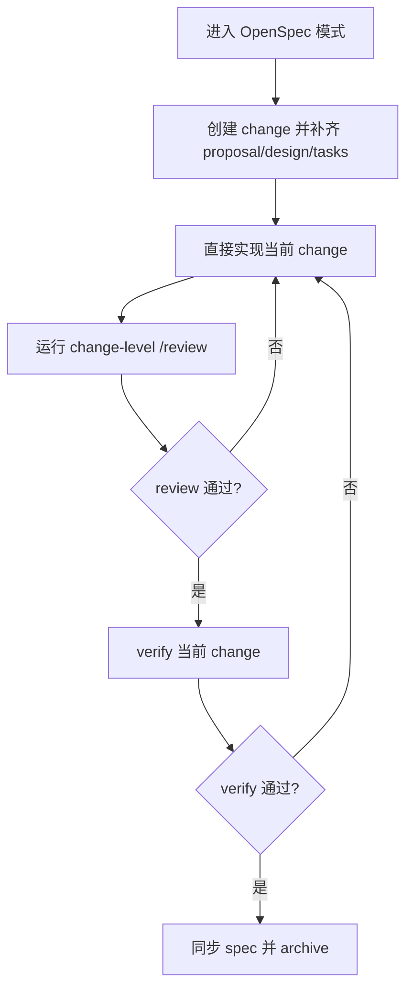
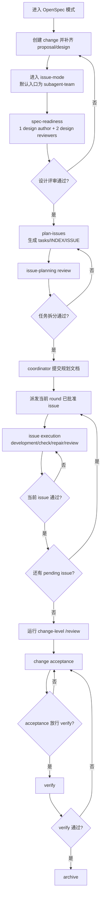

# OpenSpec Extensions

> [!IMPORTANT]
> 特别鸣谢！本 skill 基于 **唐杰** 提供的 rra subagent team 工作流基座。

OpenSpec Extensions 是 [OpenSpec](https://github.com/Fission-AI/OpenSpec) 的扩展能力集合，不替代 OpenSpec 本体。使用这些 skills 之前，必须先安装 OpenSpec，再将本仓库提供的扩展内容安装到目标仓库。

这个仓库集中管理 OpenSpec `issue-mode` 扩展 skills。

这个仓库的目标很明确：

- 用自然语言驱动 OpenSpec，而不是要求用户背 slash command
- 把复杂变更拆成 issue，并把 backlog / round / acceptance 放到磁盘
- 以 subagent-team 作为复杂 change 的默认执行主链；只在显式收窄到单 issue worker 时才使用单 subagent
- 由 coordinator 负责 reconcile、review、merge、commit、verify、archive

这里不再保留 detached worker、heartbeat、monitor-worker 这一套 fallback runtime。

## Subagent 推理强度约定

- 设计文档编写 subagent 使用 `reasoning_effort=xhigh`
- 任何会修改 repo 代码或测试的 subagent 使用 `reasoning_effort=xhigh`
- 设计评审、任务拆分、检查组、审查组、变更验收、归档收尾等非编码 subagent 使用 `reasoning_effort=medium`
- 这不是 `openspec/issue-mode.json` 的配置项，而是当前 skill / dispatch 契约
- coordinator 拉起 subagent 时要显式设置 `reasoning_effort`，不要直接继承当前会话的全局默认值

## 仓库里有什么

```text
.
├── README.md
├── scripts/
│   └── install_openspec_extensions.py
├── skills/
│   ├── openspec-chat-router/
│   ├── openspec-plan-issues/
│   ├── openspec-dispatch-issue/
│   ├── openspec-execute-issue/
│   ├── openspec-reconcile-change/
│   ├── openspec-subagent-team/
│   └── openspec-shared/
└── templates/
    └── issue-mode.json
```

## Skill 说明

| Skill | 作用 |
| --- | --- |
| `openspec-chat-router` | 自然语言路由到正确的 OpenSpec 阶段 |
| `openspec-plan-issues` | 把已可实现的 change 拆成多个 issue，并生成 issue 文档 |
| `openspec-dispatch-issue` | 为某个 issue 生成 dispatch，并创建或复用 issue workspace |
| `openspec-execute-issue` | 在单个 issue worker context 中执行实现并写进度工件 |
| `openspec-reconcile-change` | 从 `issues/*.progress.json` 和 `runs/*.json` 收敛 coordinator 状态 |
| `openspec-subagent-team` | 用 subagent team 跑整个复杂变更生命周期的开发 / 检查 / 修复 / 审查回合 |
| `openspec-shared` | 提供共享脚本、配置逻辑和 verify 相关能力 |

## 默认执行模型

复杂任务的默认路径是：

1. 主会话先把 proposal / design 补到可评审状态。
2. 主会话进入 change 级 spec-readiness；这里使用 1 个设计作者 subagent 和 2 个设计评审 subagent，设计评审通过后才能做任务拆分。
3. 用 `plan-issues` 生成或修订 `tasks.md`、`issues/INDEX.md` 和各个 `ISSUE-*.md`。
4. 主会话做 issue-planning review，确认任务拆分、边界、ownership、依赖和 acceptance。
5. 只为当前 round 已批准的 issue 创建或复用 `worker_worktree`，并生成 dispatch / team dispatch。安装模板默认是每个 change 复用一个 `.worktree/<change>`。
6. 复杂 change 的默认入口就是 subagent team；只有在显式收窄到单个 issue worker 时，才走单 worker subagent。为提速，issue planning 默认使用 `2 development + 1 check + 1 review`，issue execution 默认使用 `3 development + 2 check + 1 review` 的快路径。
7. worker 只写 issue-local progress 和 run 工件，不自合并、不自提交。
8. 主会话用 `reconcile` 从磁盘工件收敛状态，并整理 change 级 backlog / round verdict。
9. 主会话 review、merge、commit。
10. 所有必要 issue 都 accept 后，先对当前 change 修改的代码运行一次 `/review`，再做 change 级 acceptance，然后进入 `verify` / `archive`。

## Issue Workspace 模型

- `worker_worktree.scope` 现在支持 `shared`、`change`、`issue`
- 安装模板默认是 `enabled=true` 且 `scope=change`，也就是同一个 change 复用一个 `.worktree/<change>`
- 当 issue 在 change 级 worktree 中被 coordinator accept 并提交后，coordinator 会把这个 change worktree reset 到最新接受 commit，再继续后续 issue；这样后面的 issue 能直接看到前面已接受的代码
- 如果仓库没有 `openspec/issue-mode.json`，兼容回退仍是共享工作区 `.`，不会强行创建 worktree
- `.worktree/<change>/<issue>` 的 issue 级隔离 worktree 仍然保留，但只建议用于确实需要并行隔离或冲突隔离的场景
- archive 阶段建议通过 `python3 .codex/skills/openspec-shared/scripts/coordinator_archive_change.py --repo-root . --change "<change>"` 收尾；它会在归档成功后自动清理 change worktree，并在 `mode=branch` 时删除对应 branch

## Gate Barrier 约束

- 当前 phase 里真正拉起的 design review / check / review seat 都属于 gate-bearing subagent
- 这些 gate-bearing subagent 不是信息型 sidecar，而是当前 phase 的硬门禁参与者
- coordinator 必须记录这些 subagent 的 `agent_id`、seat 和完成状态
- `auto_accept_*` 的含义是“收齐当前 gate 所需 subagent verdict 后，跳过人工签字继续推进”，不是“子代理刚启动就能直接过 gate”
- 任一 required gate-bearing subagent 仍在运行时，不允许提前通过当前 phase
- 任一 required gate-bearing subagent 仍在运行时，不允许提前关闭它
- gate-bearing design review / check / review subagent 不应以 `explorer` 身份启动
- 如果要真正无人值守，建议对 gate-bearing subagent 使用最长 1 小时的阻塞等待，而不是 30 秒短轮询
- 为提速，checker / reviewer 默认应以 `changed_files -> allowed_scope -> direct dependencies` 的顺序收缩阅读范围，不应默认做 repo-wide 扫描
- 对前端项目，默认不要读取 `node_modules`、`dist`、`build`、`.next`、`coverage` 这类目录，除非当前 issue 明确把这些路径放进 `allowed_scope`

## 运行时注意点

- skill 契约层面，issue-mode 的默认 coordinator 入口是 `openspec-subagent-team`
- 但某些 Codex / agent runtime 会把“真实拉起 subagent / delegation”视为更高优先级的权限动作
- 这类 runtime 可能仍要求用户在当前会话里显式表达“启用 subagent / subagent-team / 多 agent 编排”
- 对长时间运行的 subagent 任务，如果当前 runtime / session 没有默认长等待策略，还需要显式要求 coordinator 对 subagent 使用长阻塞等待，否则可能在 subagent 完成前就提前返回
- 某些 runtime 还会让 spawned subagent 继承当前会话的全局 `reasoning_effort`；如果你希望非编码 subagent 不要都跑成 `xhigh`，必须在 spawn 时显式覆写
- 某些 runtime 还会让 spawned subagent 使用环境里的默认模型，而不是你主会话当前正在使用的模型；如果你在意结果质量或模型一致性，建议在启用 subagent 的话术里显式指定模型，否则 subagent 可能落到非预期模型，比如更低版本模型
- 对 gate-bearing design review / check / review subagent，除了长等待之外，还需要明确要求“全部完成并收齐 verdict 前不得通过 phase，也不得提前关闭 subagent”
- 所以你可能会看到两层语义同时存在：
  - skill 认为默认入口应该是 `subagent-team`
  - runtime 仍因为缺少显式授权而退回本地 coordinator 执行路径
- 这不是 `subagent_team.*` 配置开关失效；而是运行时权限策略高于 repo skill 契约
- 如果当前 runtime 仍有这类限制，最稳的用户话术是：
  - `按 issue 模式继续，并启用 subagent-team`
  - `这个 change 用 subagent team 推进`
  - `启用多 agent 编排推进当前 change`
- 如果你还想避免 subagent 用到非预期模型，最稳的用户话术再加一句：
  - `为当前 subagent team 显式指定模型，不要使用默认模型`
  - `所有 spawned subagent 都使用我指定的模型，不要回落到环境默认模型`
- 如果当前 change 会跑很久，最稳的用户话术再加一句：
  - `长时间等待 subagent 完成，使用 1 小时阻塞等待，不要 30 秒短轮询`
  - `对当前 subagent team 使用长等待，直到 subagent 完成再返回`
- 如果你还想防止 gate 提前通过，再加一句：
  - `当前 gate 的 review/check subagent 必须等待全部完成并收齐 verdict，禁止提前关闭或提前通过 phase`

## 从进入 OpenSpec 模式开始的完整链路话术

下面这些话术建议直接复制给 Codex。目标不是只告诉它“进入 issue-mode”，而是从“进入 OpenSpec 模式”开始，把简单任务和复杂任务的整条推进链路写清楚。

### 简单任务短链路

适合不需要拆成多个 issue 的需求，例如小范围页面调整、单点逻辑修复、局部交互优化。



1. 进入 OpenSpec 模式

```text
进入 OpenSpec 模式。我接下来要做一个简单任务，先按短链路推进，不要默认拆成多个 issue。
```

2. 创建 change 并补齐文档

```text
帮我为这个需求创建 change，并把 proposal、design、tasks 一次性补齐到可实现。
```

3. 直接实现当前 change

```text
开始实现当前 change；如果任务规模仍然简单，就不要进入 issue-mode，直接完成实现并运行校验。
```

4. review / verify / archive 收尾

```text
先对当前 change 修改的代码执行 /review；review 通过后再检查当前 change 是否可以归档；如果 verify 通过，就同步 spec 并归档。
```

5. 如果中途会话返回过早，继续推进

```text
继续当前 change，保持 OpenSpec 主链推进，先完成 review，再做 verify 和 archive。
```

### 复杂任务全生命周期链路

适合需要拆 issue、跑开发组/检查组/审查组回合、并由 `subagent-team` 推进的复杂变更。



1. 进入 OpenSpec 模式

```text
进入 OpenSpec 模式。我接下来要做一个复杂变更，需要按完整生命周期推进。
```

2. 创建 change 并补齐 proposal / design

```text
帮我为这个需求创建 change，并补齐 proposal、design；完成后先不要直接开始实现，也不要先拆任务。
```

3. 进入 issue-mode，并明确默认入口就是 `subagent-team`

```text
按 issue 模式继续当前 change，默认入口使用 subagent-team，用多 agent 编排推进整个复杂变更生命周期。
为所有 spawned subagent 指定 gpt 5.4 模型。
```

4. 如果希望真正无人值守推进

```text
创建一个变更，默认入口使用 subagent-team，按全自动方式推进整个生命周期，subagent 模式使用 gpt 5.4，允许自动提交代码。
需求如下：SubscribeDialogContent.vue 和 SubscribeDialogContentIntl.vue 两个组件太过雍总了，我希望优化到500-700行。
```

5. 如果你想先看设计文档和任务拆分，再人工决定是否继续

```text
先按 issue 模式补齐 proposal、design，并完成设计评审。
设计评审通过后再做任务拆分；暂时不要自动进入下一阶段，我要先看设计文档和任务拆分结果。
```

6. 如果中途会话返回过早，继续推进

```text
继续当前 change，保持 subagent-team 主链推进。
如果需要等待 subagent，使用 1 小时阻塞等待，直到 subagent 完成再返回。
如果当前 phase 还有 review/check subagent 在运行，先等它们全部完成并收齐 verdict，再决定是否进入下一阶段。
```

## 配置契约

当前支持的 `openspec/issue-mode.json` 字段如下：

```json
{
  "worktree_root": ".worktree",
  "validation_commands": ["pnpm lint", "pnpm type-check"],
  "worker_worktree": {
    "enabled": true,
    "scope": "change",
    "mode": "detach",
    "base_ref": "HEAD",
    "branch_prefix": "opsx"
  },
  "rra": {
    "gate_mode": "advisory"
  },
  "subagent_team": {
    "auto_accept_spec_readiness": false,
    "auto_accept_issue_planning": false,
    "auto_accept_issue_review": true,
    "auto_accept_change_acceptance": false,
    "auto_archive_after_verify": false
  }
}
```

说明：

- `worktree_root`、`worker_worktree.*` 仍是 active 配置
- `validation_commands` 是 issue 默认校验命令
- `worker_worktree.scope` 支持三种稳定模式：
  - `shared`：issue 直接运行在 repo root `.`；缺少 repo config 时的兼容回退仍是这个模式
  - `change`：同一个 change 复用一个 `.worktree/<change>`；这是安装模板默认值，适合串行 issue，避免后续 issue 看不到前序已接受代码
  - `issue`：每个 issue 使用 `.worktree/<change>/<issue>`；只在确实需要并行隔离时启用
- 当 `scope=change` 且某个 issue 被 coordinator accept/commit 后，coordinator 会把 change worktree reset 到最新接受 commit，再继续派发后续 issue
- archive 阶段建议使用 `coordinator_archive_change.py` 包一层 `openspec archive`；归档成功后会自动清理 change worktree，并在 `mode=branch` 时删除对应 branch
- 旧仓库如果已经显式写了 `worktree_root` / `worker_worktree.mode` 但还没有 `enabled` / `scope`，升级后仍按旧的 issue 级独立 worktree 语义兼容
- 默认安装配置里，`subagent_team.auto_accept_issue_review=true`，这样每个 issue 完成并通过 issue-local validation 后，coordinator 会自动接受并提交一次代码，再继续后续 issue
- `rra.gate_mode` 控制 RRA 这个 change-level control plane 是“给建议”还是“做硬门禁”
  - `advisory`：
    - 继续计算 round backlog / round scope / verify 放行这些 gate
    - 但只把结果写进 dispatch packet 和 reconcile 输出，不直接阻断流程
    - 适合半自动模式，或者你希望 coordinator 可以看到 gate 结论但保留人工裁量的场景
  - `enforce`：
    - 命中 gate 时会把 RRA 结论变成硬约束
    - 例如当前 round 还有 `Must fix now` 未处理，或某个 issue 不在当前 round scope 内，就会直接阻止 dispatch
    - 所有 issue 做完但 round 还没明确放行 verify 时，也会强制下一步先回到 change-level acceptance
    - 适合全自动模式，或者你希望整个生命周期严格服从 round contract 的场景
  - 可以把它理解成：
    - `advisory` = 红灯会提示，但不会强制拦车
    - `enforce` = 红灯就是红灯，不满足条件就不能继续
- `subagent_team.*` 控制 subagent team 是否自动接受当前 gate 并跨 phase 推进：
  - `auto_accept_spec_readiness`：proposal / design 经过 1 个设计作者和 2 个设计评审组成的 design review，并且 gate-bearing 设计评审 subagent 全部完成后，自动接受 spec-readiness，不再等待人工评审签字，直接进入任务拆分 / issue planning
  - `auto_accept_issue_planning`：`tasks.md` 以及 INDEX / ISSUE 文档达到可派发状态，并且当前 phase 的 gate-bearing planning/check/review subagent 全部完成后，自动接受 issue planning，不再等待人工评审签字；但在开始首个 issue execution 前，coordinator 仍会先把 `proposal.md` / `design.md` / `tasks.md` / `issues/INDEX.md` / `ISSUE-*.md` 提交成一次独立 commit，再派发当前 round 的 issue
  - `auto_accept_issue_review`：issue 进入 `review_required` 且 issue-local validation 全部通过，并且当前 round 的 gate-bearing check/review subagent 全部完成后，coordinator 自动接受并 merge/commit，然后进入下一个 issue 或 change acceptance。默认安装配置开启它，用来保证每个 issue 都先落成一次提交
  - `auto_accept_change_acceptance`：change acceptance 满足放行条件、gate-bearing review subagent 全部完成后自动接受该 gate 并进入 verify；但前提仍然是 change-level `/review` 已通过
  - `auto_archive_after_verify`：verify 通过后自动进入 archive
- `auto_accept_*` 只跳过人工签字，不跳过 gate-bearing subagent 的完成等待，也不允许提前关闭这些 subagent
- 在首个 issue 开始前，coordinator 还必须先创建一次规划文档提交；这是独立于 issue acceptance commit 的前置边界
- 如果 reconcile / control plane 的下一步是 `dispatch_next_issue`，那表示“立即继续派发”，不是“停在 control-plane ready 等下一条指令”
- `subagent_team.*` 不负责决定默认入口拓扑：
  - issue-mode 下，coordinator 默认入口就是 `openspec-subagent-team`
  - 单 worker issue path 只在显式收窄到一个 issue worker 时使用
- 但在部分 runtime 里，是否真的拉起 subagent / delegation 仍可能额外要求用户显式授权
- runtime 会基于这些值派生一个 automation profile：
- `semi_auto`：`rra.gate_mode=advisory`，并且 `spec_readiness`、`issue_planning`、`change_acceptance`、`archive` 仍需人工签字；`auto_accept_issue_review` 可以关闭，也可以开启来实现“每个 issue 自动 commit 一次代码”
- `full_auto`：`rra.gate_mode=enforce` 且五个 `subagent_team` 开关全为 `true`
- `custom`：其余任意组合

## 配置示例

### 半自动配置

适合需要人工查看设计文档、人工确认 issue planning、人工决定 verify / archive 的项目。

```json
{
  "worktree_root": ".worktree",
  "validation_commands": ["pnpm lint", "pnpm type-check"],
  "worker_worktree": {
    "enabled": true,
    "scope": "change",
    "mode": "detach",
    "base_ref": "HEAD",
    "branch_prefix": "opsx"
  },
 "rra": {
    "gate_mode": "advisory"
  },
  "subagent_team": {
    "auto_accept_spec_readiness": false,
    "auto_accept_issue_planning": false,
    "auto_accept_issue_review": false,
    "auto_accept_change_acceptance": false,
    "auto_archive_after_verify": false
  }
}
```

说明：

- spec-readiness 中的 3 个 design review subagent 通过后仍会暂停，等待 coordinator 人工接受，再进入任务拆分 / issue planning
- issue planning 达标后仍会暂停，等待 coordinator 人工接受并先提交规划文档，提交完成后才会派发首个 issue
- 单个 issue 达到 review_required 后仍会暂停，等待 coordinator 人工接受并决定是否派发下一 issue
- change acceptance 达标后仍会暂停，等待 coordinator 决定是否运行 verify
- verify 通过后会暂停，等待 coordinator 决定是否 archive
- 上面这些“暂停”只针对人工签字；gate-bearing subagent 的完成等待始终是硬前置条件
- RRA gate 会持续给出 round backlog / round scope / verify 放行建议，但不会硬性阻断流程
- 默认使用 change 级 worktree：同一个 change 的多个串行 issue 复用 `.worktree/<change>`，每次 accept 后都会同步到最新接受 commit
- 如果你更偏好完全共享工作区，可以显式切回 `scope=shared`
- 如果你希望 issue 完成并通过验证后自动提交一次代码，但其它 phase 仍保持人工签字，只需要把 `auto_accept_issue_review` 打开

### 全自动配置

适合目标是“真正无人值守推进整个复杂变更生命周期”的项目。这里的关键不是去掉 coordinator，而是让 coordinator 根据 `subagent_team.*` 开关自动跨阶段推进。

```json
{
  "worktree_root": ".worktree",
  "validation_commands": ["pnpm lint", "pnpm type-check"],
  "worker_worktree": {
    "enabled": true,
    "scope": "change",
    "mode": "detach",
    "base_ref": "HEAD",
    "branch_prefix": "opsx"
  },
  "rra": {
    "gate_mode": "enforce"
  },
  "subagent_team": {
    "auto_accept_spec_readiness": true,
    "auto_accept_issue_planning": true,
    "auto_accept_issue_review": true,
    "auto_accept_change_acceptance": true,
    "auto_archive_after_verify": true
  }
}
```

说明：

- `rra.gate_mode=enforce` 让全自动推进仍然服从 round contract，而不是无条件往下跑
- `subagent_team` 现在已经覆盖：
  - spec-readiness 中的设计评审自动接受后进入任务拆分 / issue planning
  - issue planning 自动接受后，先提交当前 change 的规划文档，再派发当前 round 的 issue，而不是停在 `control-plane ready`
  - 单个 issue 自动接受并 merge/commit 后进入下一个 issue 或 change acceptance
  - 所有 issues 完成后先运行 change-level `/review`
  - change acceptance 自动接受后进入 verify
  - verify 通过后自动 archive
- 上面这些“自动接受”仍然要求当前 phase 的 gate-bearing subagent 已全部完成并收齐 verdict
- 当 helper / reconcile 输出 `commit_planning_docs`、`dispatch_next_issue`、`auto_accept_issue`、`verify_change` 或 `archive_change` 时，coordinator 应立刻继续执行，不应把它们当作 terminal checkpoint
- coordinator 仍然存在，只是不再需要在每个 review gate 之间人工点下一步或人工签字
- 如果 RRA gate 不允许继续，流程会回到 change-level control，而不是盲目前推
- 默认使用 change 级 worktree，后续 issue 会继承前面已 accept 的代码；verify 通过后再 archive，并在 archive 收尾时清理该 change worktree
- 只有确实需要并行隔离时，才建议切到 `scope=issue`

## 安装到目标项目

```bash
python3 scripts/install_openspec_extensions.py \
  --target-repo /path/to/your/project
```

预览安装结果：

```bash
python3 scripts/install_openspec_extensions.py \
  --target-repo /path/to/your/project \
  --dry-run
```

覆盖已有同名 skills：

```bash
python3 scripts/install_openspec_extensions.py \
  --target-repo /path/to/your/project \
  --force
```

覆盖已有的 `openspec/issue-mode.json`：

```bash
python3 scripts/install_openspec_extensions.py \
  --target-repo /path/to/your/project \
  --force-config
```

安装器会写入：

- `.codex/skills/openspec-chat-router`
- `.codex/skills/openspec-plan-issues`
- `.codex/skills/openspec-dispatch-issue`
- `.codex/skills/openspec-execute-issue`
- `.codex/skills/openspec-reconcile-change`
- `.codex/skills/openspec-subagent-team`
- `.codex/skills/openspec-shared`
- `openspec/issue-mode.json`

并在需要时向目标项目 `.gitignore` 追加：

```text
.worktree/
openspec/changes/*/runs/CHANGE-VERIFY.json
openspec/changes/*/runs/CHANGE-REVIEW.json
```

## 当前状态

现在这套扩展的稳定执行模型是：

- 主链只有 coordinator + subagents
- `worker_worktree` 仍保留在契约里，安装模板默认值是 change 级 `.worktree/<change>`；缺少 repo config 时的兼容回退仍是共享工作区 `.`
- issue 级隔离 worktree `.worktree/<change>/<issue>` 仍然保留，但只在需要并行隔离时按需开启
- 复杂 change 在 issue-mode 下默认从 `openspec-subagent-team` 入口进入；单 worker path 是特例，不是默认入口
- `subagent_team.*` 覆盖 `spec_readiness -> issue_planning -> issue_execution -> change_acceptance -> verify -> archive` 全流程
- change 级 worktree 会在每次 issue acceptance commit 后被同步到最新接受 commit，并在 archive 后自动清理
- 通过 `openspec/issue-mode.json` 可以切换 `semi_auto`、`full_auto` 或自定义混合模式
